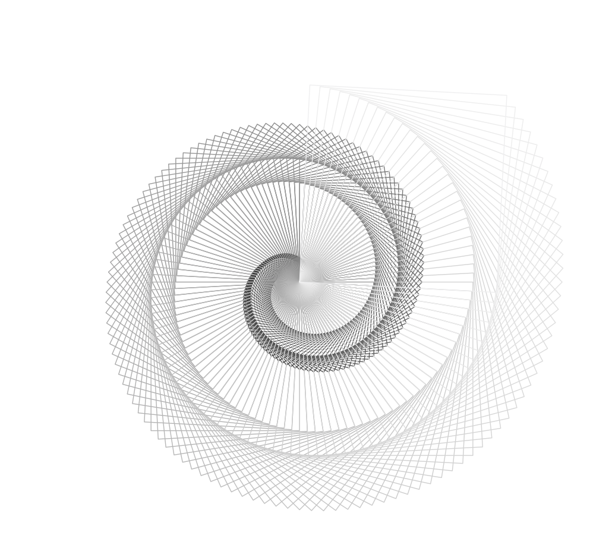

# circle
Paint circle in python using turtle
A present to friend!

Example:
```
python paint_circle.py --end_length 240 --n_edges 4 --pattern 0
python paint_circle.py --end_length 240 --n_edges 5 --pattern -1 --color red
python paint_circle.py --end_length 240 --n_edges 6 --pattern 1 --color colorful
python paint_circle.py --start_length 100 --end_length 180 --n_edges 6 --pattern 1

python paint_color.py --end_length 240 --n_edges 6
```


